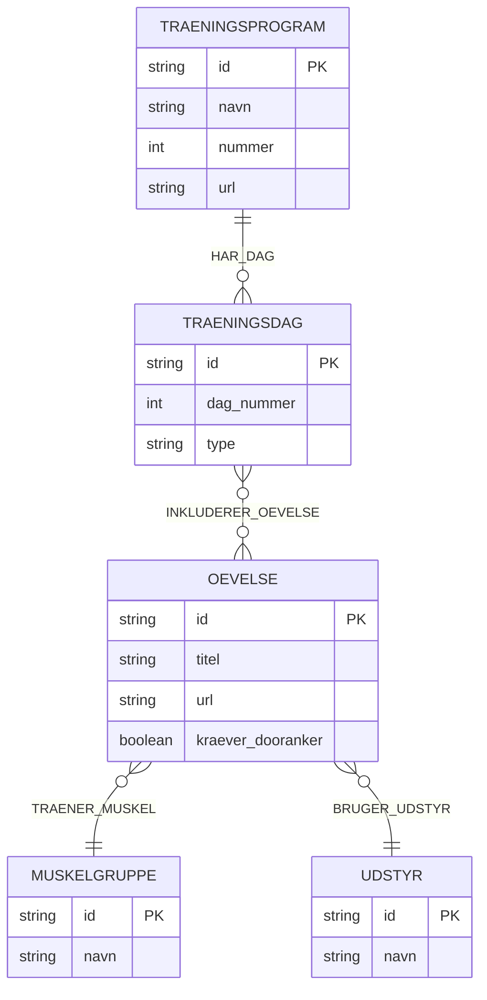

# JAAFIT Øvelsesdatabase

> **Adgang kræver JAAFIT-medlemskab på [skool.com/jaafit](https://www.skool.com/jaafit)**
> Alle links herunder kræver login.

## Vigtige URL'er

| Ressource | URL |
|-----------|-----|
| Øvelsesbibliotek (rodside) | https://www.skool.com/jaafit/classroom/1b2baa38 |
| Træningsprogrammer | https://www.skool.com/jaafit/classroom/448639cb |
| JAAFIT Community | https://www.skool.com/jaafit |

---

## ER-diagram (Databasestruktur)

---

## Graf-model: Noder og Kanter

### Nodtyper

| Nodtype | Beskrivelse | Antal |
|---------|-------------|-------|
| `Øvelse` | Enkelt øvelse med URL og udstyrskrav | 49 |
| `Muskelgruppe` | Muskelgruppe der trænes | 10 |
| `Udstyr` | Type udstyr/attachment | 6 |
| `Træningsprogram` | Samlet træningsprogram | 5 |
| `Træningsdag` | Dag i et program med øvelsesliste | 24 |

### Kanttyper (Relationer)

| Relation | Fra → Til | Beskrivelse |
|----------|-----------|-------------|
| `TRÆNER_MUSKEL` | Øvelse → Muskelgruppe | Øvelsen træner denne muskelgruppe |
| `BRUGER_UDSTYR` | Øvelse → Udstyr | Øvelsen bruger dette udstyr |
| `HAR_DAG` | Træningsprogram → Træningsdag | Programmet indeholder denne dag |
| `INKLUDERER_ØVELSE` | Træningsdag → Øvelse | Dagen inkluderer denne øvelse |

---

## Udstyrstyper

| ID | Navn | Beskrivelse |
|----|------|-------------|
| `eq_elastik` | Elastik | JAAFIT PRO elastik direkte |
| `eq_bar` | Bar | JAAFIT PRO bar-attachment |
| `eq_haandtag` | Håndtag | JAAFIT PRO håndtag-attachment |
| `eq_ankelstropper` | Ankelstropper | JAAFIT PRO ankelstropper |
| `eq_PowerPress` | PowerPress | JAAFIT PowerPress tilbehør |
| `eq_kropsvagt` | Kropsvægt | Kun kropsvægt (ingen attachment) |

---

## Øvelser per Muskelgruppe

### 🫁 Bryst
| Øvelse | Udstyr | Døranker | URL |
|--------|--------|----------|-----|
| Brystfly m. håndtag | håndtag | ✓ | https://www.skool.com/jaafit/classroom/1b2baa38?md=2b1ab4ce18d84fc8a6989120e00d1824 |
| Stående Brystpres m. bar | bar | ✓ | https://www.skool.com/jaafit/classroom/1b2baa38?md=573e4c0f38d147f593ab1f52f036eb16 |
| Fritstående Brystpres m. bar | bar | - | https://www.skool.com/jaafit/classroom/1b2baa38?md=1f7932321cb340d38ccead6c6bf3d28b |
| Armbøjning m. elastik | elastik | - | https://www.skool.com/jaafit/classroom/1b2baa38?md=7a19ac3633ea47688ad8de5859c93f03 |
| Liggende brystpres m. PowerPress | PowerPress | - | https://www.skool.com/jaafit/classroom/1b2baa38?md=8731db109e424017a2472dbf9bd9c55b |
| Stående brystpres m. PowerPress | PowerPress | - | https://www.skool.com/jaafit/classroom/1b2baa38?md=28d05260cca14bc691a153777324c7b8 |

### 🔙 Ryg
| Øvelse | Udstyr | Døranker | URL |
|--------|--------|----------|-----|
| Bent over Row m. bar | bar | - | https://www.skool.com/jaafit/classroom/1b2baa38?md=2a85ddf941904c7b8793f91cbee7a963 |
| Træk til Hofte m. håndtag (begge arme) | håndtag | ✓ | https://www.skool.com/jaafit/classroom/1b2baa38?md=1a2b6b6a598941259e97506f0dde70c6 |
| Stående Row m. bar | bar | ✓ | https://www.skool.com/jaafit/classroom/1b2baa38?md=bc8448939d6b4de4bbaf1f868898f220 |
| Pullover m. bar | bar | ✓ | https://www.skool.com/jaafit/classroom/1b2baa38?md=21c670a4f5d84c01a8a0e3a84280d087 |
| Siddende Træk til Bryst m. bar | bar | ✓ | https://www.skool.com/jaafit/classroom/1b2baa38?md=a4612851822b47518aa797ab0c28fc72 |
| Siddende pull down (1 arm) | håndtag | ✓ | https://www.skool.com/jaafit/classroom/1b2baa38?md=12d5fec659a34a0aaae05ae43a8e2de3 |
| Siddende træk til hofte m. håndtag (en arm) | håndtag | ✓ | https://www.skool.com/jaafit/classroom/1b2baa38?md=b74385a88ac44026b5bed3bbbba35218 |
| Seated row m. PowerPress | PowerPress | - | https://www.skool.com/jaafit/classroom/1b2baa38?md=0801acfa4fa54e1d8845df77df3ef9f0 |
| Bent over row m. PowerPress | PowerPress | - | https://www.skool.com/jaafit/classroom/1b2baa38?md=1ee1031e9c6343fe81b612194b620437 |

### 🦵 Forlår
| Øvelse | Udstyr | Døranker | URL |
|--------|--------|----------|-----|
| Squat m. bar | bar | - | https://www.skool.com/jaafit/classroom/1b2baa38?md=bb50d1d9bee444528887906d40c07b34 |
| Split Squat m. bar | bar | - | https://www.skool.com/jaafit/classroom/1b2baa38?md=8461e0d9e9dd4c35872734d03092b8ea |
| Front Squat m. bar | bar | - | https://www.skool.com/jaafit/classroom/1b2baa38?md=ce15f8fe0c9d47ec8f2278f534b96b20 |
| Begyndervenlig Squat m. bar | bar | - | https://www.skool.com/jaafit/classroom/1b2baa38?md=ea1a793cfae948e2819054015ce6a5cd |
| Leg Extension m. ankelstropper | ankelstropper | ✓ | https://www.skool.com/jaafit/classroom/1b2baa38?md=23cda7c5540d4549996cf51ecd23479a |

### 🍑 Baglår og baller
| Øvelse | Udstyr | Døranker | URL |
|--------|--------|----------|-----|
| Hofte Extension m. håndtag | håndtag | ✓ | https://www.skool.com/jaafit/classroom/1b2baa38?md=7aee8ec48aab422fb2df2b4a09452b55 |
| Donkey Kick m. ankelstropper | ankelstropper | ✓ | https://www.skool.com/jaafit/classroom/1b2baa38?md=171aaafa82e147439900695ac5eaec36 |
| Rumænsk Dødløft m. bar | bar | - | https://www.skool.com/jaafit/classroom/1b2baa38?md=4a63032c35fe402ab6416a127eac5ecd |
| Dødløft m. bar | bar | - | https://www.skool.com/jaafit/classroom/1b2baa38?md=f77d97b6c2db4271af5496cb9d036bf5 |
| Leg Curl m. ankelstropper | ankelstropper | ✓ | https://www.skool.com/jaafit/classroom/1b2baa38?md=ff6526db998140368cee351fa2184ed1 |
| Hip Thrust m. bar | bar | - | https://www.skool.com/jaafit/classroom/1b2baa38?md=b43cec0635494eeaa7eb602bab97b6c1 |
| Rumænsk dødløft m. PowerPress | PowerPress | - | https://www.skool.com/jaafit/classroom/1b2baa38?md=bbc611bcea8946ba9267da0fb9493b84 |

### 🦵 Inder- og ydersiden af lårene
| Øvelse | Udstyr | Døranker | URL |
|--------|--------|----------|-----|
| Adduction m. ankelstropper | ankelstropper | ✓ | https://www.skool.com/jaafit/classroom/1b2baa38?md=794c1c718af9464a9d8099973e00fdaa |
| Abduktion m. ankelstropper | ankelstropper | ✓ | https://www.skool.com/jaafit/classroom/1b2baa38?md=5aeac24a3d354740b2314864e005386a |

### 💪 Biceps
| Øvelse | Udstyr | Døranker | URL |
|--------|--------|----------|-----|
| Biceps Curl m. bar | bar | - | https://www.skool.com/jaafit/classroom/1b2baa38?md=1e407305f56e4c178e5f67fea9ca5d84 |
| Biceps Curl "Faceaway" m. håndtag | håndtag | ✓ | https://www.skool.com/jaafit/classroom/1b2baa38?md=6f01796cb46f4d798d2ec24e017edff9 |
| Hammercurl m. elastik | elastik | - | https://www.skool.com/jaafit/classroom/1b2baa38?md=3be46dbb6f4d45b08d0570c100b2e835 |

### 💪 Triceps
| Øvelse | Udstyr | Døranker | URL |
|--------|--------|----------|-----|
| Triceps Pushdown m. håndtag | håndtag | ✓ | https://www.skool.com/jaafit/classroom/1b2baa38?md=07d4f5ea9a444a83901be6c2485164a5 |
| Skullcrusher m. bar | bar | - | https://www.skool.com/jaafit/classroom/1b2baa38?md=39e9e9e70fd441b0978840bcb99fbcf0 |
| Triceps Extension m. elastik | elastik | - | https://www.skool.com/jaafit/classroom/1b2baa38?md=6c5732539ca24ce69ba99790fc39d519 |
| Triceps Kickback m. elastik | elastik | - | https://www.skool.com/jaafit/classroom/1b2baa38?md=1883d88e769548d3a6a09419e4ae1b8c |
| Triceps Pushdown m. elastik | elastik | - | https://www.skool.com/jaafit/classroom/1b2baa38?md=3d282b1b76424a8a88850cae89c55ff2 |
| Triceps Pushdown m. bar | bar | ✓ | https://www.skool.com/jaafit/classroom/1b2baa38?md=831f796f738d41478e165a2c03924dcb |

### 🏋️ Skulder
| Øvelse | Udstyr | Døranker | URL |
|--------|--------|----------|-----|
| Overhead Press m. bar | bar | - | https://www.skool.com/jaafit/classroom/1b2baa38?md=03b4a420e2b04921a89813fd2dfddbe7 |
| Lateral Raises m. håndtag | håndtag | - | https://www.skool.com/jaafit/classroom/1b2baa38?md=785b16d8e44744a49db0c2abd1322004 |
| Rear Delt Fly m. elastik | elastik | - | https://www.skool.com/jaafit/classroom/1b2baa38?md=3e7115bbf11a4b3186734902c07c59a1 |
| Lateral Raise m. døranker (Øvet) | håndtag | ✓ | https://www.skool.com/jaafit/classroom/1b2baa38?md=0f13ee8efc0449e582961b757adefdc1 |
| Front Raise m. håndtag | håndtag | - | https://www.skool.com/jaafit/classroom/1b2baa38?md=946f3cabfd314b2883520918a2abfc82 |
| Face Pull m. håndtag | håndtag | ✓ | https://www.skool.com/jaafit/classroom/1b2baa38?md=55b79aab39ad4e1f9ac8323abe15f3ac |

### 🏃 Mave
| Øvelse | Udstyr | Døranker | URL |
|--------|--------|----------|-----|
| Side Bend m. elastik | elastik | - | https://www.skool.com/jaafit/classroom/1b2baa38?md=fa7a7fc50aeb41688709858222bf800e |
| Chrunches m. elastik | elastik | - | https://www.skool.com/jaafit/classroom/1b2baa38?md=3c405fd6ecf94a53b5d10e6f2c7e48b3 |
| Leg Raises m. ankelstropper | ankelstropper | ✓ | https://www.skool.com/jaafit/classroom/1b2baa38?md=4c48a8783f3f4925b5ece9a0c3b2c767 |

### 🦶 Læg
| Øvelse | Udstyr | Døranker | URL |
|--------|--------|----------|-----|
| Calf Raises m. bar | bar | - | https://www.skool.com/jaafit/classroom/1b2baa38?md=888cc143f1214523adb2bfd576b1356d |
| Calf Raises m. kropsvægt | kropsvægt | - | https://www.skool.com/jaafit/classroom/1b2baa38?md=e9278e59e4e54c3e86d3b5d08b636d38 |

---

## Træningsprogrammer

> URL til alle programmer: https://www.skool.com/jaafit/classroom/448639cb

### Program 1: Effektiv Velvære
2 dage / fullbody

| Dag | Type | Øvelser |
|-----|------|---------|
| 1 | Fullbody | Stående Brystpres, Stående Row, Lateral Raises, Triceps Extension m. elastik, Leg Extension, Leg Curl |
| 2 | Fullbody | Dødløft, Begyndervenlig Squat, Brystfly, Træk til Hofte, Overhead Press, Biceps Curl |

### Program 2: Feminin Styrke
3 dage / fullbody

| Dag | Type | Øvelser |
|-----|------|---------|
| 1 | Fullbody | Rumænsk Dødløft, Abduktion, Adduction, Træk til Hofte, Triceps Pushdown, Chrunches m. elastik |
| 2 | Fullbody | Front Squat, Overhead Press, Biceps Curl, Hofte Extension, Donkey Kick, Leg Raises |
| 3 | Fullbody | Dødløft, Begyndervenlig Squat, Bent over Row, Lateral Raises, Stående Brystpres, Side Bend m. elastik |

### Program 3: Hverdagskrigeren
5 dage / split

| Dag | Type | Øvelser |
|-----|------|---------|
| 1 | Ben & Biceps | Dødløft, Biceps Curl |
| 2 | Ryg & Triceps | Træk til Hofte, Triceps Pushdown |
| 3 | Bryst & Skuldre | Stående Brystpres, Lateral Raises |
| 4 | Ben & Biceps | Front Squat, Hammercurl m. elastik |
| 5 | Mave & Skuldre | Overhead Press, Chrunches m. elastik |

### Program 4: Fundamental Styrke
4 dage / upper-lower split

| Dag | Type | Øvelser |
|-----|------|---------|
| 1 | Lower 1 | Front Squat, Rumænsk Dødløft, Leg Extension, Leg Curl, Chrunches m. elastik |
| 2 | Upper 1 | Brystfly, Træk til Hofte, Overhead Press, Biceps Curl, Skullcrusher |
| 3 | Lower 2 | Dødløft, Split Squat, Abduktion, Adduction, Leg Raises |
| 4 | Upper 2 | Fritstående Brystpres, Bent over Row, Triceps Extension m. elastik, Biceps Curl Faceaway, Lateral Raises |

### Program 5: Maksimal Styrke
6 dage / push-pull-legs

| Dag | Type | Øvelser |
|-----|------|---------|
| 1 | Push 1 | Armbøjning m. elastik, Brystfly, Triceps Pushdown m. håndtag, Lateral Raises |
| 2 | Pull 1 | Siddende Træk til Bryst, Pullover, Biceps Curl, Face Pull |
| 3 | Legs 1 | Leg Extension, Leg Curl, Front Squat, Dødløft |
| 4 | Push 2 | Overhead Press, Brystfly, Fritstående Brystpres, Triceps Pushdown m. elastik |
| 5 | Pull 2 | Bent over Row, Siddende pull down, Rear Delt Fly m. elastik, Hammercurl m. elastik |
| 6 | Legs 2 | Front Squat, Dødløft, Leg Extension, Leg Curl |

---

## Øvelser med elastik (ingen døranker)

Disse øvelser kan laves overalt uden at fastgøre elastikken i en dør:

| Øvelse | Muskelgruppe |
|--------|-------------|
| Armbøjning m. elastik | Bryst |
| Hammercurl m. elastik | Biceps |
| Triceps Extension m. elastik | Triceps |
| Triceps Kickback m. elastik | Triceps |
| Triceps Pushdown m. elastik | Triceps |
| Rear Delt Fly m. elastik | Skulder |
| Side Bend m. elastik | Mave |
| Chrunches m. elastik | Mave |

---

## Datafiler

| Fil | Indhold |
|-----|---------|
| `jaafit_database.json` | Komplet graph-database (JSON) |
| `jaafit_oevelsesdatabase.md` | Denne dokumentationsfil |
| `jaafit_graph.html` | Interaktiv grafisk visualisering |

---

*Sidst opdateret: 2026-03-16 | Data kilde: JAAFIT Community på skool.com*
